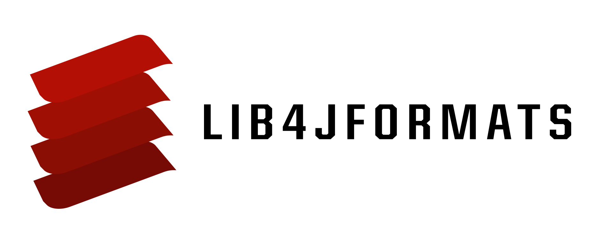

# lib4jformats

  <a href="https://github.com/boreals-back-again/lib4jformats">
    <picture>
      <source srcset="./docs/logo/l4jf-dark.png" media="(prefers-color-scheme: dark)">
      
    </picture>
  </a>

This C++17 library implements the properitary file types 4J Studios made for Minecraft: Legacy Console Edition. 

With an optional dependency on [json](https://github.com/nlohmann/json), some file types can be converted to and from JSON.

Building instructions: [docs/build.md](docs/build.md)

This includes:
- .ARC (Archive file)
- .LOC (Localization file)
- .COL (Colour file)
- .PCK (Pack file)
- .MSSCMP (Miles Sound System Soundbank)

This does not cover game saves, or anything the can write to.
For that, there is [libLCE](https://github.com/DexrnZacAtack/libLCE).

> "Make it right. Make it good. Make it fast"
